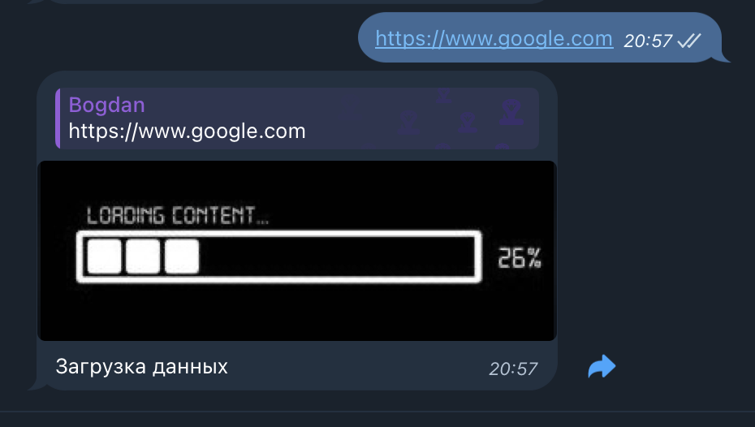
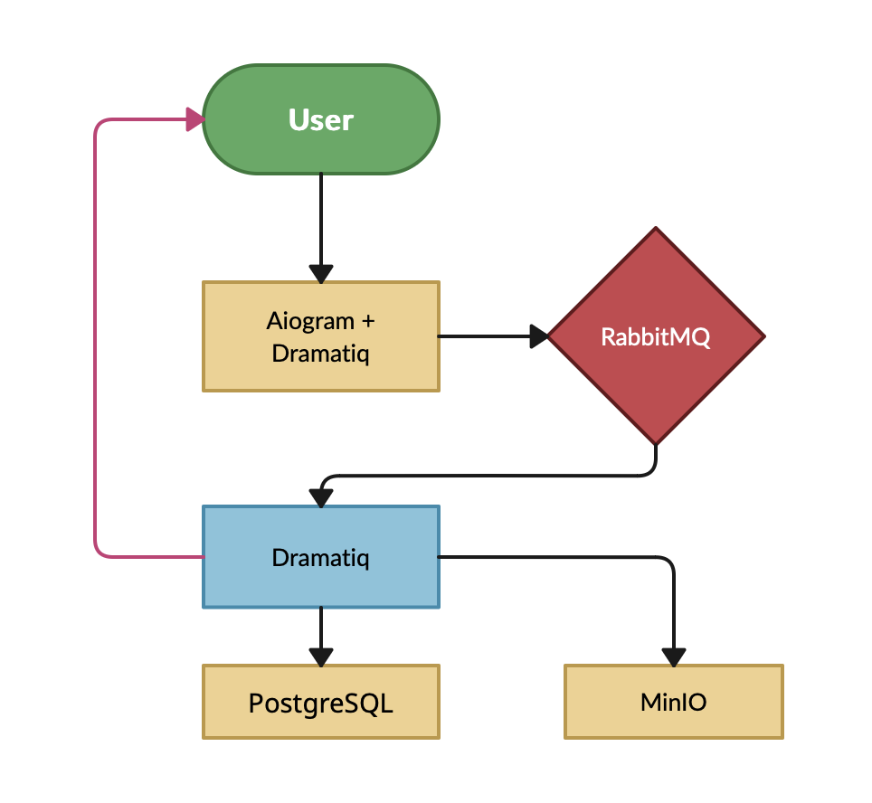

# Бот Скриншотер (Тестовое задание)

## Технологии:
- Python 3.10
  - Aiogram
  - Dramatiq
  - Pydantic
  - Playwright
  - SQLalchemy
- PostgreSQL
- RabbitMQ
- Minio

## Описание:
Бот позволяет сделать скриншот любого общедоступного сайта,
ссылку на который который Вы отправите ему в сообщении.

## Примеры ответов:

## Схема работы:

## Как запустить:
- ### Клонировать:
    - `git clone https://github.com/bog2530/tg_screenshot_url.git`
- ### Перейти в дирректорию:
  - `cd tg_screenshot_url`
- ### Запуск через docker-compose:
  - `docker-compose up -d --build`
  
## Примечание:
Бот развернут через [Polling](https://habr.com/ru/companies/otus/articles/786754/#),
для прода нужен Webhook.

## Автор:
- [Шумский Богдан]([https://t.me/bog2530)
- bog2530@gmail.com